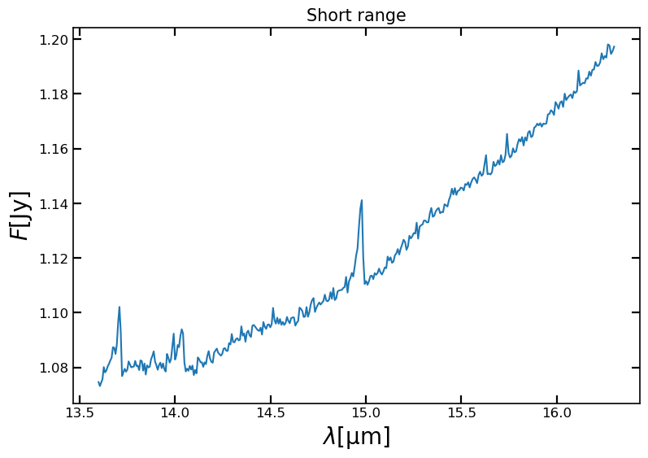
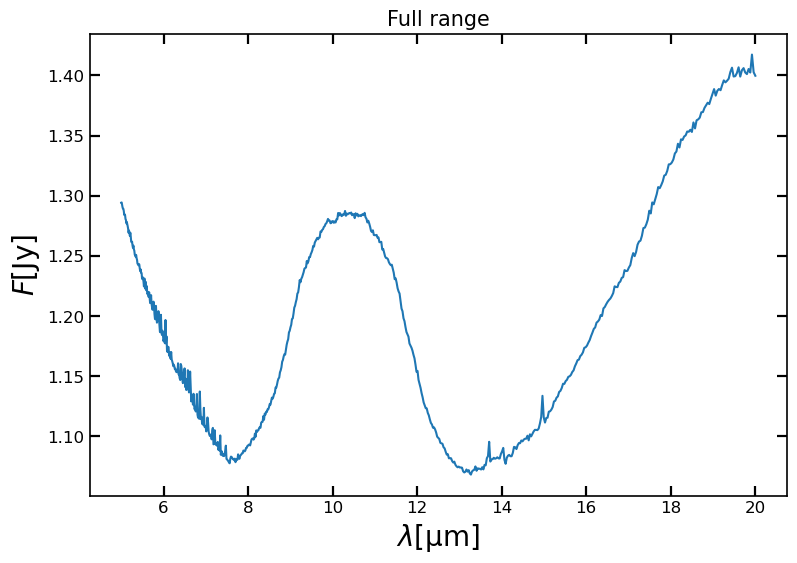
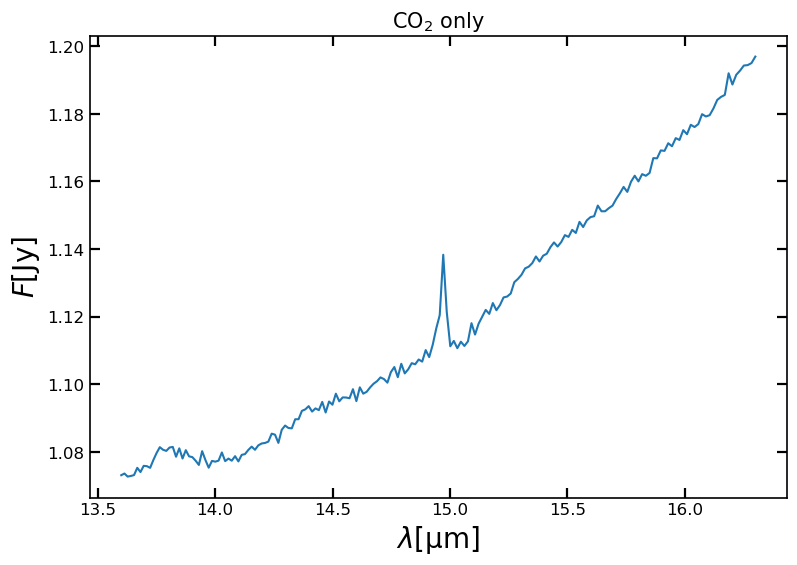

### Observations

This folder contains all the mock observations that are used in this tutorial.  
If you are fitting other observations they don't need to be placed here.
You can specify the path in the input file.

Below you find the figures of all observations

