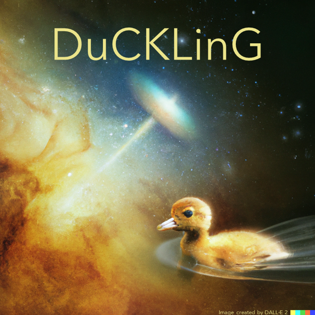

# DuCKLinG hands-on session

Below you find the step by step instructions on how to run this session.  

During this project you will fit a mock observation that was created by DuCKLinG ([Kaeufer et al. 2024](https://www.aanda.org/articles/aa/pdf/2024/07/aa49936-24.pdf)).

The goal is to answer a few questions during the process.

The quiz can be accessed [here](https://www.canva.com/design/DAGe7S1YAoM/UEEmq63JZn2cyPYtBioAJQ/edit?utm_content=DAGe7S1YAoM&utm_campaign=designshare&utm_medium=link2&utm_source=sharebutton).

At different steps during this tutorial, I'll ask you to go to the quiz and answer a few questions. We can discusss common difficulties at the end of the session.

## Steps

These steps guide you through the tutorial. A more detailed explanation is given below. 

- Downloading the data
- Installation
- Exploring the observations
- Running a retrieval
- Plotting the retrieval results
- Creating new input files and exploring the effects (optional)

## Detailed explanation of the individual steps

### Downloading the data
Clone this repository `git clone https://github.com/tillkaeufer/duckling_hands-on_session`.

Alternatively, you can click on the green 'code' button on the top right and then on 'download zip'.
If you do this you need to unpack your zip file.

Since the slab grids are part of this repository, it has a size of a few hundred megabits. 
Make sure you have a good internet connection when downloading.

At the end of this step you should have somewhere a folder called 'duckling_hands-on_session'.

Can you lastly go into the LineData folder and create a subfolder called binned_data, please.

### Installation
We will be working in a Python 3 environment and need a few python packages.
First, make sure that you have python 3 running. If you are using conda and want to create a new environment you can do this with the follwoing command:

`conda create --name duckling_handson python=3.9`  

`conda activate duckling_handson`

Second, go in the terminal to the 'duckling_hands-on_session' folder and run the following command:

`pip install -r requirements.txt` 

This should hopefully install a bunch of packages.

You can test if everything is installed correctly by running:

`python test_installation.py` 

If you are having a working version of MultiNest on your machine you can also run 'pip install pymultinest' and set use_ultranest=False in the input files for the retrieval.  
This will result in MultiNest instead of Ultranest being used for the retrieval, which is typically (for the examples displayed here) much faster.

### Exploring the observations

At this point you can have a look at the individual observations that are available for fitting.  
You find them in the 'Observations' folder. 
Look at the images and try to answer the first four questions of the [quiz](https://www.canva.com/design/DAGe7S1YAoM/UEEmq63JZn2cyPYtBioAJQ/edit?utm_content=DAGe7S1YAoM&utm_campaign=designshare&utm_medium=link2&utm_source=sharebutton).

### Running a retrieval

We will start by fitting the CO2_only observation, since it should be the fastest (1min 7sec on my machine, let's see if you can beat this..).

A single command will start the retrieval (hopefully).
  
For doing so, make your that you are in the 'duckling_hands-on_session' folder and run the following command:

`python retrieval-input.py ./Input_files/input_file_co2_only.txt`

Now you to be a bit patient depending on your machine.  
The output of your terminal shows the progress of the fitting. A guide on the meaning can be found on the [ultranest page](https://johannesbuchner.github.io/UltraNest/issues.html#what-does-the-live-point-display-mean).

While you are waiting for the run to finish have a look at the input file that is used (found in the 'Input_files' folder).
Try to understand what the individual lines in the input files are doing and answering the next questions of the [quiz](https://www.canva.com/design/DAGe7S1YAoM/UEEmq63JZn2cyPYtBioAJQ/edit?utm_content=DAGe7S1YAoM&utm_campaign=designshare&utm_medium=link2&utm_source=sharebutton).
The README file in the 'Input_files' folder can help you to understand the parameter syntax.

One the fitting is done you can proceed to the plotting of the results.

### Plotting the retrieval results

When the retrieval finished you can plot the results using the following command:

`python plot_retrieval_results.py ./Input_files/input_file_co2_only.txt all reduce_post 1000`

The 'all' argument means that all three plotting rountines are executed. The 'reduce_post 1000' argument means that we are not analysing the full posterior but only draw 1000 random points from it. This is only done for this tutorial to increase the computational speed.  

The programms can take a little while. Depending on your machine figures might pop up during the run. Make sure to close them otherwise the programm stays interupted.

Afterwards there should be a folder called './Output/co2_only/figures'.  
Open this folder and explore the figures that where created.  
Use them to answer the next questions on the [quiz](https://www.canva.com/design/DAGe7S1YAoM/UEEmq63JZn2cyPYtBioAJQ/edit?utm_content=DAGe7S1YAoM&utm_campaign=designshare&utm_medium=link2&utm_source=sharebutton).

If you made it this far, **congratulations** you are now able to fit any observation with DuCKLinG!!!  

The full DuCKLinG model can be found in another [github repository](https://github.com/tillkaeufer/DuCKLinG). The main difference is that the tutorial repo uses smaller slab grid and uses ultranest without the option of running multinest and is therefore easier to install.  

The optional things I planed are listed below.

### Optional next steps

Feel free to continue playing around by changing things in the input file and exploring the effect on the fit. Make sure to change the run_number if you are starting a new run.

#### How to model dust absorption features?

#### How many water components where used here?

##### How to model gas absorption features?

##### Fitting the continuum subtracted spectrum

